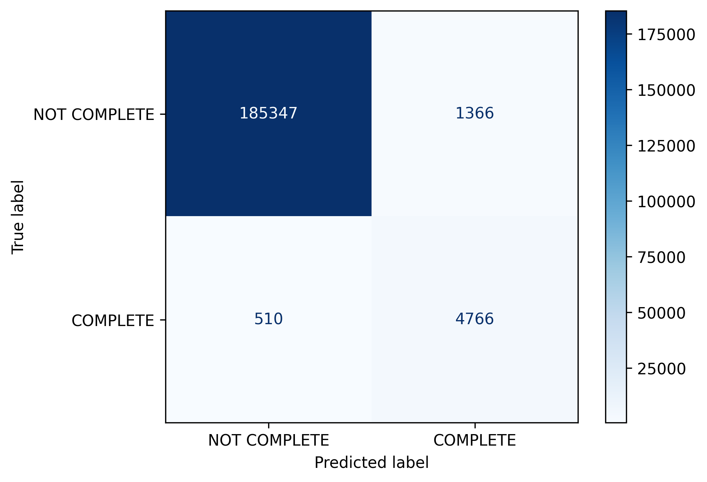

# Student Course Completion Prediction

## Problem Statement
Online courses often suffer from low completion rates. The objective of this project is to predict whether a student will complete a course based on their engagement patterns, course characteristics, and prior learning behavior.

Early identification of at-risk students can help educators and learning platforms design timely interventions to improve student outcomes and reduce dropout rates.

## Dataset Overview

The dataset consists of student-level interaction data collected from online courses. It includes:

Student engagement metrics (e.g., number of events, active days, chapters explored)
Course-related information (e.g., course duration)
Demographic and background attributes
Engineered behavioral features derived from activity patterns
Categorical variables were encoded, missing values were handled, and outliers were treated using custom preprocessing pipelines.

## Project Structure

├── data/
│   ├── raw/
│   ├── processed/
├── notebooks/
│   ├── 01_eda_student_course_completion.ipynb
│   ├── 02_model_evaluation_and_insights.ipynb
├── src/
│   ├── data/
│   ├── data_validation/
│   ├── data_splitting/
│   ├── features/
│   ├── models/
├── reports/
│   ├── figures/
├── saved_models/
├── requirements.txt
├── README.md
|__ .gitignore
|__ app.py

## Models Trained

The following models were trained and evaluated:

Logistic Regression (baseline, interpretable)
Random Forest
XGBoost
LightGBM

Hyperparameter tuning and probability threshold optimization were performed to balance recall and precision for the target class.

## Evaluation Strategy

The dataset is highly imbalanced, with significantly fewer students completing courses.

Therefore:
Accuracy alone is not a reliable metric.
Primary focus was on Recall and F1-score for the completion class.

This ensures that students who are likely to complete—or are at risk of not completing—are identified as effectively as possible.

## Model Performance

Among all models, XGBoost achieved the best overall performance.
Threshold tuning was applied to control false positives.
A higher threshold was selected to better identify students at risk of non-completion.

## Confusion Matrix Analysis

The confusion matrix was analyzed to understand trade-offs between identifying at-risk students and avoiding unnecessary interventions.
The final threshold reduces the number of students incorrectly classified as likely to complete, ensuring that more at-risk students are captured for potential support.



## Model Interpretability

Model interpretability was assessed during development using grouped permutation importance and SHAP (SHapley Additive Explanations) to understand both global and local feature contributions.

The analysis confirmed that **student engagement features**—such as number of events, active days, and chapters accessed—were the strongest drivers of course completion. This aligned well with domain intuition and validated the model’s behavior.
Demographic features have relatively low influence.
High engagement consistently increases the likelihood of completion.

SHAP visualizations were used exclusively for **model validation and debugging** and are not exposed in the deployed application. This design choice ensures that end users receive clear, intuitive explanations without unnecessary technical complexity.

## Business Insights

Student engagement is the strongest predictor of course completion.
Monitoring early engagement signals can help identify students at risk.
Interventions should focus on increasing active participation and consistent interaction. Increasing the content quality can also increase student engagement and course completion.

## Deployment

The trained XGBoost model was deployed using **Streamlit** to provide an interactive
web interface for real-time course completion prediction.

### Application Features
- User-friendly form for entering student and engagement details
- Probability-based prediction with a fixed decision threshold (0.89)
- Plain-English explanation of prediction results
- Fast, lightweight inference using a pre-trained pipeline

### Running the App Locally

1. Clone the repository:
   ```bash
   git clone https://github.com/poojaraghu9119/student-course-completion-prediction.git
   cd student-course-completion-prediction

   cd student-course-completion-prediction

2. Install dependencies:
   pip install -r requirements.txt

3. Run the streamlit app
   streamlit run app.py


## Limitations & Future Work

The model relies on aggregated engagement metrics and does not capture temporal changes in student behavior.
Students who engage later in the course may be harder to identify accurately.

Future work includes:

Temporal and sequence-based features
Error analysis on misclassified students
Real-time prediction and intervention strategies

## Technologies Used

Python
pandas, NumPy
scikit-learn
XGBoost, LightGBM
SHAP
Matplotlib, Seaborn
Streamlit