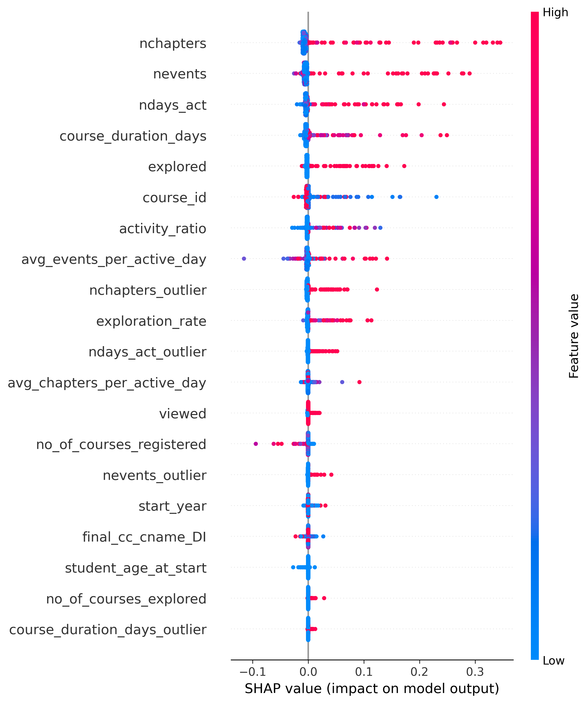

# User Churn Prediction And Retention Analysis (E-Learning Platform)

## Problem Statement
Online courses often suffer from low completion rates. The objective of this project is to predict whether a user will complete a course or churn off based on their engagement patterns, course characteristics, and prior learning behavior.

Early identification of at-risk users can help educators and learning platforms design timely interventions to improve student outcomes and reduce dropout rates.

## Dataset Overview

The dataset consists of student-level interaction data collected from online courses. It includes:

Student engagement metrics (e.g., number of events, active days, chapters explored)
Course-related information (e.g., course duration)
Demographic and background attributes
Engineered behavioral features derived from activity patterns
Categorical variables were encoded, missing values were handled, and outliers were treated using custom preprocessing pipelines.

## Exploratory Data Analysis (EDA)

EDA was conducted to understand user behavior patterns and their relationship with course completion. Plots like heatmaps, barplots, boxplots, kdeplot were plotted to understand the correlation between the features, find hidden patterns, check for outliers, and check the data distribution.

Key insights:
- Course completion is highly correlated with **engagement metrics** such as:
  - Number of events (`nevents`)
  - Active days (`ndays_act`)
  - Chapters explored (`nchapters`)
- Users with low interaction early in the course are significantly more likely to drop out.
- Demographic features (e.g., gender, level of education, country) showed weaker individual impact compared to behavioral features.
- The dataset was highly **imbalanced**, with substantially fewer students completing the course, motivating threshold optimization and class-weighting strategies.

These insights guided feature engineering, model selection, and evaluation strategy.
## Data Preprocessing & Feature Engineering

A robust preprocessing pipeline was built using scikit-learn Pipelines to ensure consistency between training and deployment.

Steps included:
- **Missing value imputation** using domain-appropriate strategies
- **Categorical encoding**
  - Mapping encoding for ordinal features
  - Frequency encoding for high-cardinality categorical variables
- **Outlier handling** for engagement features
- **Feature engineering**
  - New features like activity ratio, exploration rate, course duration, etc were created. 
- **Feature scaling and transformation** embedded directly in the pipeline

All preprocessing steps are applied identically during inference, ensuring no data leakage.

## Model Development & Selection

Multiple classification models were trained and evaluated:

- Logistic Regression (baseline, interpretable)
- Random Forest
- LightGBM
- XGBoost

Model comparison was based on:
- Precision, Recall, and F1-score
- ROC-AUC
- Business relevance (false positives vs false negatives)

### Why XGBoost?

XGBoost was selected as the final model because it:
- Achieved the **highest F1-score** among all models
- Handled non-linear feature interactions effectively
- Was robust to feature scaling and multicollinearity
- Provided strong generalization on unseen data

Hyperparameter tuning and probability threshold optimization were performed to balance recall and precision for the target class.

## Evaluation Strategy

The dataset is highly imbalanced, with significantly fewer users completing courses.

Therefore:
Accuracy alone is not a reliable metric.
Primary focus was on Recall and F1-score for the completion class.

This ensures that students who are likely to complete—or are at risk of not completing—are identified as effectively as possible.

## Confusion Matrix Analysis

The confusion matrix was analyzed to understand trade-offs between identifying at-risk users and avoiding unnecessary interventions.
The final threshold reduces the number of students incorrectly classified as likely to complete, ensuring that more at-risk users are captured for potential support.


## Model Interpretability

Model interpretability was assessed during development using grouped permutation importance and SHAP (SHapley Additive Explanations) to understand both global and local feature contributions.

The analysis confirmed that **user engagement features**—such as number of events, active days, and chapters accessed—were the strongest drivers of course completion. This aligned well with domain intuition and validated the model’s behavior.
Demographic features have relatively low influence.
High engagement consistently increases the likelihood of completion.


SHAP visualizations were used exclusively for **model validation and debugging** and are not exposed in the deployed application. This design choice ensures that end users receive clear, intuitive explanations without unnecessary technical complexity.

## Business Insights

User engagement is the strongest predictor of course completion.
Monitoring early engagement signals can help identify users at risk.
Interventions should focus on increasing active participation and consistent interaction. Increasing the content quality can also increase user engagement and course completion.

## Early Intervention Experiment (Simulated A/B Analysis)

To estimate real-world impact of the suggested actions, a simulated intervention experiment was conducted.
Users with predicted completion probability between 0.2 and 0.5 were identified as moderately at-risk learners. These users were randomly divided into two groups:
- No-help group
- Help group (simulated intervention)
For the help group, engagement metrics were increased (active days +30%, total events +20%) to simulate reminder-based intervention.
The trained model was re-evaluated to estimate expected completion outcomes.

Results:
- No-help estimated completion rate: 32.87%
- Help estimated completion rate: 39.96%
- Estimated lift: +7.1 percentage points

This suggests that targeted early engagement interventions for moderately at-risk users could meaningfully improve course completion rates.

## Deployment

The model is deployed as an interactive web application using **Streamlit Cloud**.

🔗 **Live Application:**  
https://student-course-completion-prediction.streamlit.app/

The application allows users to input user engagement, demographic, and course-related information and returns a prediction on whether the user is likely to complete the course.

### Application Features
- User-friendly form for entering user and engagement details
- Probability-based prediction with a fixed decision threshold (0.89)
- Plain-English explanation of prediction results
- Fast, lightweight inference using a pre-trained pipeline

### Running the App Locally

1. Clone the repository:
   ```bash
   git clone https://github.com/poojaraghu9119/student-course-completion-prediction.git
   cd student-course-completion-prediction

   cd student-course-completion-prediction

2. Create and activate a conda environment
   conda create -n student_course_completion python=3.10
   conda activate student_course_completion

3. Install dependencies:
   pip install -r requirements.txt

4. Run the streamlit app
   streamlit run app.py


## Limitations & Future Work

The model relies on aggregated engagement metrics and does not capture temporal changes in user behavior.
Users who engage later in the course may be harder to identify accurately.

Future work includes:

Temporal and sequence-based features
Error analysis on misclassified users
Real-time prediction and intervention strategies

## Technologies Used

Python,
pandas, NumPy,
scikit-learn,
XGBoost, LightGBM,
SHAP
Matplotlib, Seaborn
Streamlit
